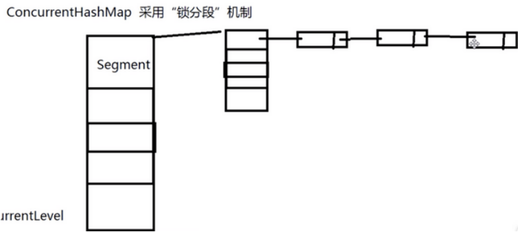
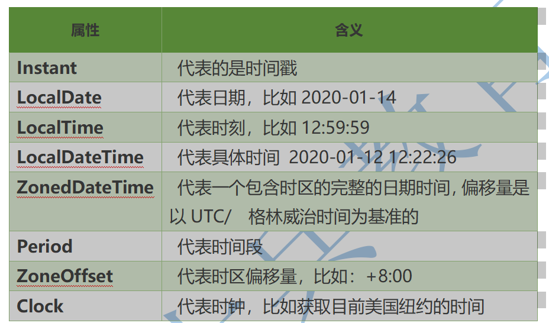
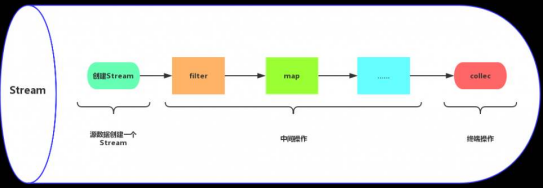
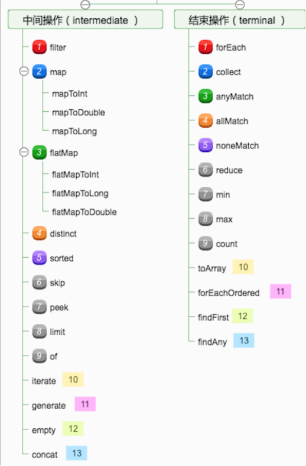
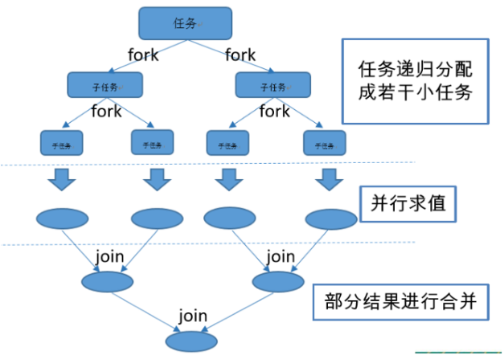
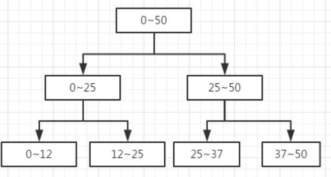
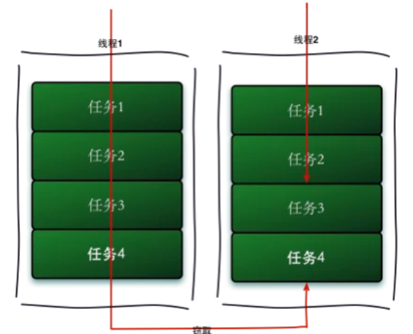

# MCA Java Base
## 面试题：

### 请聊一下java的集合类，以及在实际项目中你是如何用的？
参照java集合一章
注意说出集合体系,常用类 接口  实现类
加上你所知道的高并发集合类,JUC      参照集合增强内容
在实际项目中引用,照实说就好了
问集合的引子 … …

### Hashmap为什么要使用红黑树？
在jdk1.8版本后，java对HashMap做了改进，在链表长度大于8的时候，将后面的数据存在红黑树中，以加快检索速度
红黑树虽然本质上是一棵二叉查找树，但它在二叉查找树的基础上增加了着色和相关的性质使得红黑树相对平衡，从而保证了红黑树的查找、插入、删除的时间复杂度最坏为O(log n)。加快检索速率。
集合类是怎么解决高并发中的问题？
思路 先说一下那些是非安全
普通的安全的集合类
JUC中高并发的集合类

线程非安全的集合类 ArrayList LinkedList HashSet TreeSet HashMap TreeMap 实际开发中我们自己用这样的集合最多,因为一般我们自己写的业务代码中,不太涉及到多线程共享同一个集合的问题
线程安全的集合类 Vector HashTable 虽然效率没有JUC中的高性能集合高,但是也能够适应大部分环境
高性能线程安全的集合类
  1.ConcurrentHashMap
  2.ConcurrentHashMap和HashTable的区别
  3.ConcurrentHashMap线程安全的具体实现方式/底层具体实现
  4.说说CopyOnWriteArrayList

ConcurrentHashMap
java5.0在juc包中提供了大量支持并发的容器类，采用“锁分段”机制，Concurrentlevel分段级别，默认16，就是有16个段（segment)，每个段默认又有16个哈希表（table），每个又有链表连着。

在JDK1.7的时候，ConcurrentHashMap（分段锁） 对整个桶数组进行了分割分段(Segment)，每一把锁只锁容器其中一部分数据，多线程访问容器里不同数据段的数据，就不会存在锁竞争。
DK1.8ConcurrentHashMap取消了Segment分段锁，采用CAS和synchronized来保证并发安全。数据结构跟HashMap1.8的结构类似，数组+链表/红黑二叉树。Java 8在链表长度超过一定阈值（8）时将链表（寻址时间复杂度为O(N)）转换为红黑树（寻址时间复杂度为O(log(N))）
synchronized只锁定当前链表或红黑二叉树的首节点，这样只要hash不冲突，就不会产生并发，效率又提升N倍。

ConcurrentSkipListMap是线程安全的有序的哈希表(相当于线程安全的TreeMap); 它继承于AbstractMap类，并且实现ConcurrentNavigableMap接口。ConcurrentSkipListMap是通过“跳表”来实现的，
ConcurrentSkipListSet是线程安全的有序的集合(相当于线程安全的TreeSet)；它继承于AbstractSet，并实现了NavigableSet接口。ConcurrentSkipListSet是通过ConcurrentSkipListMap实现的，它也支持并发。

CopyOnWriteArraySet addIfAbsent和 CopyOnWriteArrayList（写入并复制）也是juc里面的，它解决了并发修改异常，每当有写入的时候，就在底层重新复制一个新容器写入，最后把新容器的引用地址赋给旧的容器，在别人写入的时候，其他线程读数据，依然是旧容器的线程。这样是开销很大的，所以不适合频繁写入的操作。适合并发迭代操作多的场景。只能保证数据的最终一致性

简述一下自定义异常的应用场景？
借助异常机制,我们可以省略很多业务逻辑上的判断处理,直接借助java的异常机制可以简化业务逻辑判断代码的编写
1当你不想把你的错误直接暴露给前端或者你想让前端从业务角度判断后台的异常，这个时候自定义异常类是你的不二选择
2 虽然JAVA给我们提供了丰富的异常类型,但是在实际的业务上,还有很多情况JAVA提供的异常类型不能准确的表述出我们业务上的含义
3 控制项目的后期服务 … …
描述一下Object类中常用的方法？
参照面向对象章节toString hashCode equals clone finalized wait notify notifyAll … …
解释每个方法的作用
toString 定义一个对象的字符串表现形式  Object类中定义的规则是 类的全路径名+@+对象的哈希码 重写之后 我们可以自行决定返回的字符串中包含对象的那些属性信息 …
clone >>>返回一个对象的副本  深克隆 浅克隆 原型模式 重写时实现Cloneable
finalized GC 会调动该方法 自救
1.8的新特性有了解过吗？    (注意了解其他版本新特征) +JDK更新认识
Lambda表达式
函数式接口 函数式编程
方法引用和构造器调用
Stream API
接口中的默认方法和静态方法
新时间日期API
新的日期类

一、接口的默认方法
Java 8允许我们给接口添加一个非抽象的方法实现，只需要使用 default关键字即可，这个特征又叫做扩展方法，示例如下：
代码如下:
interface Formula { double calculate(int a);
default double sqrt(int a) { return Math.sqrt(a); } }
Formula接口在拥有calculate方法之外同时还定义了sqrt方法，实现了Formula接口的子类只需要实现一个calculate方法，默认方法sqrt将在子类上可以直接使用。
代码如下:
Formula formula = new Formula() { @Override public double calculate(int a) { return sqrt(a * 100); } };
formula.calculate(100); // 100.0 formula.sqrt(16); // 4.0
文中的formula被实现为一个匿名类的实例，该代码非常容易理解，6行代码实现了计算 sqrt(a * 100)。在下一节中，我们将会看到实现单方法接口的更简单的做法。
译者注： 在Java中只有单继承，如果要让一个类赋予新的特性，通常是使用接口来实现，在C++中支持多继承，允许一个子类同时具有多个父类的接口与功能，在其他语言中，让一个类同时具有其他的可复用代码的方法叫做mixin。新的Java 8 的这个特新在编译器实现的角度上来说更加接近Scala的trait。 在C#中也有名为扩展方法的概念，允许给已存在的类型扩展方法，和Java 8的这个在语义上有差别。
二、Lambda 表达式
首先看看在老版本的Java中是如何排列字符串的：
代码如下:
List<String> names = Arrays.asList("peterF", "anna", "mike", "xenia");
Collections.sort(names, new Comparator<String>() { @Override public int compare(String a, String b) { return b.compareTo(a); } });
只需要给静态方法 Collections.sort 传入一个List对象以及一个比较器来按指定顺序排列。通常做法都是创建一个匿名的比较器对象然后将其传递给sort方法。
在Java 8 中你就没必要使用这种传统的匿名对象的方式了，Java 8提供了更简洁的语法，lambda表达式：
代码如下:
Collections.sort(names, (String a, String b) -> { return b.compareTo(a); });
看到了吧，代码变得更段且更具有可读性，但是实际上还可以写得更短：
代码如下:
Collections.sort(names, (String a, String b) -> b.compareTo(a));
对于函数体只有一行代码的，你可以去掉大括号{}以及return关键字，但是你还可以写得更短点：
代码如下:
Collections.sort(names, (a, b) -> b.compareTo(a));
Java编译器可以自动推导出参数类型，所以你可以不用再写一次类型。接下来我们看看lambda表达式还能作出什么更方便的东西来：
三、函数式接口
Lambda表达式是如何在java的类型系统中表示的呢？每一个lambda表达式都对应一个类型，通常是接口类型。而“函数式接口”是指仅仅只包含一个抽象方法的接口，每一个该类型的lambda表达式都会被匹配到这个抽象方法。因为 默认方法 不算抽象方法，所以你也可以给你的函数式接口添加默认方法。
我们可以将lambda表达式当作任意只包含一个抽象方法的接口类型，确保你的接口一定达到这个要求，你只需要给你的接口添加 @FunctionalInterface 注解，编译器如果发现你标注了这个注解的接口有多于一个抽象方法的时候会报错的。
示例如下：
代码如下:
@FunctionalInterface interface Converter<F, T> { T convert(F from); } Converter<String, Integer> converter = (from) -> Integer.valueOf(from); Integer converted = converter.convert("123"); System.out.println(converted); // 123
需要注意如果@FunctionalInterface如果没有指定，上面的代码也是对的。
译者注 将lambda表达式映射到一个单方法的接口上，这种做法在Java 8之前就有别的语言实现，比如Rhino JavaScript解释器，如果一个函数参数接收一个单方法的接口而你传递的是一个function，Rhino 解释器会自动做一个单接口的实例到function的适配器，典型的应用场景有 org.w3c.dom.events.EventTarget 的addEventListener 第二个参数 EventListener。
四、方法与构造函数引用
前一节中的代码还可以通过静态方法引用来表示：
代码如下:
Converter<String, Integer> converter = Integer::valueOf; Integer converted = converter.convert("123"); System.out.println(converted); // 123
Java 8 允许你使用 :: 关键字来传递方法或者构造函数引用，上面的代码展示了如何引用一个静态方法，我们也可以引用一个对象的方法：
代码如下:
converter = something::startsWith; String converted = converter.convert("Java"); System.out.println(converted); // "J"
接下来看看构造函数是如何使用::关键字来引用的，首先我们定义一个包含多个构造函数的简单类：
代码如下:
class Person { String firstName; String lastName;
Person() {}
Person(String firstName, String lastName) { this.firstName = firstName; this.lastName = lastName; } }
接下来我们指定一个用来创建Person对象的对象工厂接口：
代码如下:
interface PersonFactory
 { P create(String firstName, String lastName); }
这里我们使用构造函数引用来将他们关联起来，而不是实现一个完整的工厂：
代码如下:
PersonFactory<Person> personFactory = Person::new; Person person = personFactory.create("Peter", "Parker");
我们只需要使用 Person::new 来获取Person类构造函数的引用，Java编译器会自动根据PersonFactory.create方法的签名来选择合适的构造函数。
五、Lambda 作用域
在lambda表达式中访问外层作用域和老版本的匿名对象中的方式很相似。你可以直接访问标记了final的外层局部变量，或者实例的字段以及静态变量。
六、访问局部变量
我们可以直接在lambda表达式中访问外层的局部变量：
代码如下:
final int num = 1; Converter<Integer, String> stringConverter = (from) -> String.valueOf(from + num);
stringConverter.convert(2); // 3
但是和匿名对象不同的是，这里的变量num可以不用声明为final，该代码同样正确：
代码如下:
int num = 1; Converter<Integer, String> stringConverter = (from) -> String.valueOf(from + num);
stringConverter.convert(2); // 3
不过这里的num必须不可被后面的代码修改（即隐性的具有final的语义），例如下面的就无法编译：
代码如下:
int num = 1; Converter<Integer, String> stringConverter = (from) -> String.valueOf(from + num); num = 3;
在lambda表达式中试图修改num同样是不允许的。
七、访问对象字段与静态变量
和本地变量不同的是，lambda内部对于实例的字段以及静态变量是即可读又可写。该行为和匿名对象是一致的：
代码如下:
class Lambda4 { static int outerStaticNum; int outerNum;
void testScopes() { Converter<Integer, String> stringConverter1 = (from) -> { outerNum = 23; return String.valueOf(from); };
Converter<Integer, String> stringConverter2 = (from) -> { ​ outerStaticNum = 72; ​ return String.valueOf(from); ​ }; } }
八、访问接口的默认方法
还记得第一节中的formula例子么，接口Formula定义了一个默认方法sqrt可以直接被formula的实例包括匿名对象访问到，但是在lambda表达式中这个是不行的。 Lambda表达式中是无法访问到默认方法的，以下代码将无法编译：
代码如下:
Formula formula = (a) -> sqrt( a * 100); Built-in Functional Interfaces
JDK 1.8 API包含了很多内建的函数式接口，在老Java中常用到的比如Comparator或者Runnable接口，这些接口都增加了@FunctionalInterface注解以便能用在lambda上。 Java 8 API同样还提供了很多全新的函数式接口来让工作更加方便，有一些接口是来自Google Guava库里的，即便你对这些很熟悉了，还是有必要看看这些是如何扩展到lambda上使用的。
Predicate接口
Predicate 接口只有一个参数，返回boolean类型。该接口包含多种默认方法来将Predicate组合成其他复杂的逻辑（比如：与，或，非）：
代码如下:
Predicate<String> predicate = (s) -> s.length() > 0;
predicate.test("foo"); // true predicate.negate().test("foo"); // false
Predicate<Boolean> nonNull = Objects::nonNull; Predicate<Boolean> isNull = Objects::isNull;
Predicate<String> isEmpty = String::isEmpty; Predicate<String> isNotEmpty = isEmpty.negate();
Function 接口
Function 接口有一个参数并且返回一个结果，并附带了一些可以和其他函数组合的默认方法（compose, andThen）：
代码如下:
Function<String, Integer> toInteger = Integer::valueOf; Function<String, String> backToString = toInteger.andThen(String::valueOf);
backToString.apply("123"); // "123"
Supplier 接口 Supplier 接口返回一个任意范型的值，和Function接口不同的是该接口没有任何参数
代码如下:
Supplier<Person> personSupplier = Person::new; personSupplier.get(); // new Person
Consumer 接口 Consumer 接口表示执行在单个参数上的操作。
代码如下:
Consumer<Person> greeter = (p) -> System.out.println("Hello, " + p.firstName); greeter.accept(new Person("Luke", "Skywalker"));
Comparator 接口 Comparator 是老Java中的经典接口， Java 8在此之上添加了多种默认方法：
代码如下:
Comparator<Person> comparator = (p1, p2) -> p1.firstName.compareTo(p2.firstName);
Person p1 = new Person("John", "Doe"); Person p2 = new Person("Alice", "Wonderland");
comparator.compare(p1, p2); // > 0 comparator.reversed().compare(p1, p2); // < 0
Optional 接口
Optional 不是函数是接口，这是个用来防止NullPointerException异常的辅助类型，这是下一届中将要用到的重要概念，现在先简单的看看这个接口能干什么：
Optional 被定义为一个简单的容器，其值可能是null或者不是null。在Java 8之前一般某个函数应该返回非空对象但是偶尔却可能返回了null，而在Java 8中，不推荐你返回null而是返回Optional。
代码如下:
Optional<String> optional = Optional.of("bam");
optional.isPresent(); // true optional.get(); // "bam" optional.orElse("fallback"); // "bam"
optional.ifPresent((s) -> System.out.println(s.charAt(0))); // "b"
Stream 接口
java.util.Stream 表示能应用在一组元素上一次执行的操作序列。Stream 操作分为中间操作或者最终操作两种，最终操作返回一特定类型的计算结果，而中间操作返回Stream本身，这样你就可以将多个操作依次串起来。Stream 的创建需要指定一个数据源，比如 java.util.Collection的子类，List或者Set， Map不支持。Stream的操作可以串行执行或者并行执行。
首先看看Stream是怎么用，首先创建实例代码的用到的数据List：
代码如下:
List<String> stringCollection = new ArrayList<>(); stringCollection.add("ddd2"); stringCollection.add("aaa2"); stringCollection.add("bbb1"); stringCollection.add("aaa1"); stringCollection.add("bbb3"); stringCollection.add("ccc"); stringCollection.add("bbb2"); stringCollection.add("ddd1");
Java 8扩展了集合类，可以通过 Collection.stream() 或者 Collection.parallelStream() 来创建一个Stream。下面几节将详细解释常用的Stream操作：
Filter 过滤
过滤通过一个predicate接口来过滤并只保留符合条件的元素，该操作属于中间操作，所以我们可以在过滤后的结果来应用其他Stream操作（比如forEach）。forEach需要一个函数来对过滤后的元素依次执行。forEach是一个最终操作，所以我们不能在forEach之后来执行其他Stream操作。
代码如下:
stringCollection .stream() .filter((s) -> s.startsWith("a")) .forEach(System.out::println);
// "aaa2", "aaa1"
Sort 排序
排序是一个中间操作，返回的是排序好后的Stream。如果你不指定一个自定义的Comparator则会使用默认排序。
代码如下:
stringCollection .stream() .sorted() .filter((s) -> s.startsWith("a")) .forEach(System.out::println);
// "aaa1", "aaa2"
需要注意的是，排序只创建了一个排列好后的Stream，而不会影响原有的数据源，排序之后原数据stringCollection是不会被修改的：
代码如下:
System.out.println(stringCollection); // ddd2, aaa2, bbb1, aaa1, bbb3, ccc, bbb2, ddd1
Map 映射 中间操作map会将元素根据指定的Function接口来依次将元素转成另外的对象，下面的示例展示了将字符串转换为大写字符串。你也可以通过map来讲对象转换成其他类型，map返回的Stream类型是根据你map传递进去的函数的返回值决定的。
代码如下:
stringCollection .stream() .map(String::toUpperCase) .sorted((a, b) -> b.compareTo(a)) .forEach(System.out::println);
// "DDD2", "DDD1", "CCC", "BBB3", "BBB2", "AAA2", "AAA1"
Match 匹配
Stream提供了多种匹配操作，允许检测指定的Predicate是否匹配整个Stream。所有的匹配操作都是最终操作，并返回一个boolean类型的值。
代码如下:
boolean anyStartsWithA = stringCollection .stream() .anyMatch((s) -> s.startsWith("a"));
System.out.println(anyStartsWithA); // true
boolean allStartsWithA = stringCollection .stream() .allMatch((s) -> s.startsWith("a"));
System.out.println(allStartsWithA); // false
boolean noneStartsWithZ = stringCollection .stream() .noneMatch((s) -> s.startsWith("z"));
System.out.println(noneStartsWithZ); // true
Count 计数 计数是一个最终操作，返回Stream中元素的个数，返回值类型是long。
代码如下:
long startsWithB = stringCollection .stream() .filter((s) -> s.startsWith("b")) .count();
System.out.println(startsWithB); // 3
Reduce 规约
这是一个最终操作，允许通过指定的函数来讲stream中的多个元素规约为一个元素，规越后的结果是通过Optional接口表示的：
代码如下:
Optional<String> reduced = stringCollection .stream() .sorted() .reduce((s1, s2) -> s1 + "#" + s2);
reduced.ifPresent(System.out::println); // "aaa1#aaa2#bbb1#bbb2#bbb3#ccc#ddd1#ddd2"
并行Streams
前面提到过Stream有串行和并行两种，串行Stream上的操作是在一个线程中依次完成，而并行Stream则是在多个线程上同时执行。
下面的例子展示了是如何通过并行Stream来提升性能：
首先我们创建一个没有重复元素的大表：
代码如下:
int max = 1000000; List<String> values = new ArrayList<>(max); for (int i = 0; i < max; i++) { UUID uuid = UUID.randomUUID(); values.add(uuid.toString()); }
然后我们计算一下排序这个Stream要耗时多久， 串行排序：
代码如下:
long t0 = System.nanoTime();
long count = values.stream().sorted().count(); System.out.println(count);
long t1 = System.nanoTime();
long millis = TimeUnit.NANOSECONDS.toMillis(t1 - t0); System.out.println(String.format("sequential sort took: %d ms", millis));
// 串行耗时: 899 ms 并行排序：
代码如下:
long t0 = System.nanoTime();
long count = values.parallelStream().sorted().count(); System.out.println(count);
long t1 = System.nanoTime();
long millis = TimeUnit.NANOSECONDS.toMillis(t1 - t0); System.out.println(String.format("parallel sort took: %d ms", millis));
// 并行排序耗时: 472 ms 上面两个代码几乎是一样的，但是并行版的快了50%之多，唯一需要做的改动就是将stream()改为parallelStream()。
Map
前面提到过，Map类型不支持stream，不过Map提供了一些新的有用的方法来处理一些日常任务。
代码如下:
Map<Integer, String> map = new HashMap<>();
for (int i = 0; i < 10; i++) { map.putIfAbsent(i, "val" + i); }
map.forEach((id, val) -> System.out.println(val)); 以上代码很容易理解， putIfAbsent 不需要我们做额外的存在性检查，而forEach则接收一个Consumer接口来对map里的每一个键值对进行操作。
下面的例子展示了map上的其他有用的函数：
代码如下:
map.computeIfPresent(3, (num, val) -> val + num); map.get(3); // val33
map.computeIfPresent(9, (num, val) -> null); map.containsKey(9); // false
map.computeIfAbsent(23, num -> "val" + num); map.containsKey(23); // true
map.computeIfAbsent(3, num -> "bam"); map.get(3); // val33
接下来展示如何在Map里删除一个键值全都匹配的项：
代码如下:
map.remove(3, "val3"); map.get(3); // val33
map.remove(3, "val33"); map.get(3); // null
另外一个有用的方法：
代码如下:
map.getOrDefault(42, "not found"); // not found
对Map的元素做合并也变得很容易了：
代码如下:
map.merge(9, "val9", (value, newValue) -> value.concat(newValue)); map.get(9); // val9
map.merge(9, "concat", (value, newValue) -> value.concat(newValue)); map.get(9); // val9concat
Merge做的事情是如果键名不存在则插入，否则则对原键对应的值做合并操作并重新插入到map中。
九、Date API
Java 8 在包java.time下包含了一组全新的时间日期API。新的日期API和开源的Joda-Time库差不多，但又不完全一样，下面的例子展示了这组新API里最重要的一些部分：
Clock 时钟
Clock类提供了访问当前日期和时间的方法，Clock是时区敏感的，可以用来取代 System.currentTimeMillis() 来获取当前的微秒数。某一个特定的时间点也可以使用Instant类来表示，Instant类也可以用来创建老的java.util.Date对象。
代码如下:
Clock clock = Clock.systemDefaultZone(); long millis = clock.millis();
Instant instant = clock.instant(); Date legacyDate = Date.from(instant); // legacy java.util.Date
Timezones 时区
在新API中时区使用ZoneId来表示。时区可以很方便的使用静态方法of来获取到。 时区定义了到UTS时间的时间差，在Instant时间点对象到本地日期对象之间转换的时候是极其重要的。
代码如下:
System.out.println(ZoneId.getAvailableZoneIds()); // prints all available timezone ids
ZoneId zone1 = ZoneId.of("Europe/Berlin"); ZoneId zone2 = ZoneId.of("Brazil/East"); System.out.println(zone1.getRules()); System.out.println(zone2.getRules());
// ZoneRules[currentStandardOffset=+01:00] // ZoneRules[currentStandardOffset=-03:00]
LocalTime 本地时间
LocalTime 定义了一个没有时区信息的时间，例如 晚上10点，或者 17:30:15。下面的例子使用前面代码创建的时区创建了两个本地时间。之后比较时间并以小时和分钟为单位计算两个时间的时间差：
代码如下:
LocalTime now1 = LocalTime.now(zone1); LocalTime now2 = LocalTime.now(zone2);
System.out.println(now1.isBefore(now2)); // false
long hoursBetween = ChronoUnit.HOURS.between(now1, now2); long minutesBetween = ChronoUnit.MINUTES.between(now1, now2);
System.out.println(hoursBetween); // -3 System.out.println(minutesBetween); // -239
LocalTime 提供了多种工厂方法来简化对象的创建，包括解析时间字符串。
代码如下:
LocalTime late = LocalTime.of(23, 59, 59); System.out.println(late); // 23:59:59
DateTimeFormatter germanFormatter = DateTimeFormatter .ofLocalizedTime(FormatStyle.SHORT) .withLocale(Locale.GERMAN);
LocalTime leetTime = LocalTime.parse("13:37", germanFormatter); System.out.println(leetTime); // 13:37
LocalDate 本地日期
LocalDate 表示了一个确切的日期，比如 2014-03-11。该对象值是不可变的，用起来和LocalTime基本一致。下面的例子展示了如何给Date对象加减天/月/年。另外要注意的是这些对象是不可变的，操作返回的总是一个新实例。
代码如下:
LocalDate today = LocalDate.now(); LocalDate tomorrow = today.plus(1, ChronoUnit.DAYS); LocalDate yesterday = tomorrow.minusDays(2);
LocalDate independenceDay = LocalDate.of(2014, Month.JULY, 4); DayOfWeek dayOfWeek = independenceDay.getDayOfWeek();
System.out.println(dayOfWeek); // FRIDAY 从字符串解析一个LocalDate类型和解析LocalTime一样简单：
代码如下:
DateTimeFormatter germanFormatter = DateTimeFormatter .ofLocalizedDate(FormatStyle.MEDIUM) .withLocale(Locale.GERMAN);
LocalDate xmas = LocalDate.parse("24.12.2014", germanFormatter); System.out.println(xmas); // 2014-12-24
LocalDateTime 本地日期时间
LocalDateTime 同时表示了时间和日期，相当于前两节内容合并到一个对象上了。LocalDateTime和LocalTime还有LocalDate一样，都是不可变的。LocalDateTime提供了一些能访问具体字段的方法。
代码如下:
LocalDateTime sylvester = LocalDateTime.of(2014, Month.DECEMBER, 31, 23, 59, 59);
DayOfWeek dayOfWeek = sylvester.getDayOfWeek(); System.out.println(dayOfWeek); // WEDNESDAY
Month month = sylvester.getMonth(); System.out.println(month); // DECEMBER
long minuteOfDay = sylvester.getLong(ChronoField.MINUTE_OF_DAY); System.out.println(minuteOfDay); // 1439
只要附加上时区信息，就可以将其转换为一个时间点Instant对象，Instant时间点对象可以很容易的转换为老式的java.util.Date。
代码如下:
Instant instant = sylvester .atZone(ZoneId.systemDefault()) .toInstant();
Date legacyDate = Date.from(instant); System.out.println(legacyDate); // Wed Dec 31 23:59:59 CET 2014
格式化LocalDateTime和格式化时间和日期一样的，除了使用预定义好的格式外，我们也可以自己定义格式：
代码如下:
DateTimeFormatter formatter = DateTimeFormatter .ofPattern("MMM dd, yyyy - HH:mm");
LocalDateTime parsed = LocalDateTime.parse("Nov 03, 2014 - 07:13", formatter); String string = formatter.format(parsed); System.out.println(string); // Nov 03, 2014 - 07:13
和java.text.NumberFormat不一样的是新版的DateTimeFormatter是不可变的，所以它是线程安全的。
十、Annotation 注解
在Java 8中支持多重注解了，先看个例子来理解一下是什么意思。 首先定义一个包装类Hints注解用来放置一组具体的Hint注解：
代码如下:
@interface Hints { Hint[] value(); }
@Repeatable(Hints.class) @interface Hint { String value(); }
Java 8允许我们把同一个类型的注解使用多次，只需要给该注解标注一下@Repeatable即可。
例 1: 使用包装类当容器来存多个注解（老方法）
代码如下:
@Hints({@Hint("hint1"), @Hint("hint2")}) class Person {}
例 2：使用多重注解（新方法）
代码如下:
@Hint("hint1") @Hint("hint2") class Person {}
第二个例子里java编译器会隐性的帮你定义好@Hints注解，了解这一点有助于你用反射来获取这些信息：
代码如下:
Hint hint = Person.class.getAnnotation(Hint.class); System.out.println(hint); // null
Hints hints1 = Person.class.getAnnotation(Hints.class); System.out.println(hints1.value().length); // 2
Hint[] hints2 = Person.class.getAnnotationsByType(Hint.class); System.out.println(hints2.length); // 2
即便我们没有在Person类上定义@Hints注解，我们还是可以通过 getAnnotation(Hints.class) 来获取 @Hints注解，更加方便的方法是使用 getAnnotationsByType 可以直接获取到所有的@Hint注解。 另外Java 8的注解还增加到两种新的target上了：
代码如下:
@Target({ElementType.TYPE_PARAMETER, ElementType.TYPE_USE}) @interface MyAnnotation {}
关于Java 8的新特性就写到这了，肯定还有更多的特性等待发掘。JDK 1.8里还有很多很有用的东西，比如Arrays.parallelSort, StampedLock和CompletableFuture等等。

简述一下Java面向对象的基本特征，继承、封装与多态，以及你自己的应用？
知识参照面向对象章节
注意单独解释 继承 封装 多态的概念
继承 基本概念解释 后面多态的条件
封装 基本概念解释 隐藏实现细节,公开使用方式
多态 基本概念解释 就是处理参数  提接口 打破单继承
设计模式 设计原则
Java中重写和重载的区别？
联系: 名字相似 都是多个同名方法
重载  在同一个类之中发生的
重写 继承中,子类重写父类方法
1 目的差别
2 语法差别

怎样声明一个类不会被继承，什么场景下会用？
final修饰的类不能有子类 大部分都是出于安全考虑
String举例

Java中的自增是线程安全的吗，如何实现线程安全的自增？
i++     ++i
增加synchronized进行线程同步
使用lock、unlock处理Reetrantent 锁进行锁定
AtomicInteger >>> Unsafe >>> cas >>> aba
首先说明，此处 AtomicInteger，一个提供原子操作的 Integer 的类，常见的还有AtomicBoolean、AtomicInteger、AtomicLong、AtomicReference 等，他们的实现原理相同，区别在与运算对象类型的不同。令人兴奋地，还可以通过 AtomicReference<V>将一个对象的所有操作转化成原子操作。
我们知道，在多线程程序中，诸如++i 或 i++等运算不具有原子性，是不安全的线程操作之一。通常我们会使用 synchronized 将该操作变成一个原子操作，但 JVM 为此类操作特意提供了一些同步类，使得使用更方便，且使程序运行效率变得更高。通过相关资料显示，通常AtomicInteger 的性能是 ReentantLock 的好几倍。
Jdk1.8中的stream有用过吗，详述一下stream的并行操作原理？stream并行的线程池是从哪里来的？
Stream作为Java8的一大亮点，它与java.io包里的InputStream和OutputStream是完全不同的概念。它是对容器对象功能的增强，它专注于对容器对象进行各种非常便利、高效的聚合操作或者大批量数据操作。
Stream API借助于同样新出现的Lambda表达式，极大的提高编程效率和程序可读性。同时，它提供串行和并行两种模式进行汇聚操作，并发模式能够充分利用多核处理器的优势，使用fork/join并行方式来拆分任务和加速处理过程。所以说，Java8中首次出现的 java.util.stream是一个函数式语言+多核时代综合影响的产物。
Stream有如下三个操作步骤：
一、创建Stream：从一个数据源，如集合、数组中获取流。
二、中间操作：一个操作的中间链，对数据源的数据进行操作。
三、终止操作：一个终止操作，执行中间操作链，并产生结果。

当数据源中的数据上了流水线后，这个过程对数据进行的所有操作都称为“中间操作”。中间操作仍然会返回一个流对象，因此多个中间操作可以串连起来形成一个流水线。比如map (mapToInt, flatMap 等)、filter、distinct、sorted、peek、limit、skip、parallel、sequential、unordered。
当所有的中间操作完成后，若要将数据从流水线上拿下来，则需要执行终止操作。终止操作将返回一个执行结果，这就是你想要的数据。比如：forEach、forEachOrdered、toArray、reduce、collect、min、max、count、anyMatch、allMatch、noneMatch、findFirst、findAny、iterator。
多个中间操作可以连接起来形成一个流水线，除非流水线上触发终止操作，否则中间操作不会执行任何处理！而在终止操作时一次性全部处理，称作“惰性求值”。
stream并行原理: 其实本质上就是在ForkJoin上进行了一层封装，将Stream 不断尝试分解成更小的split，然后使用fork/join 框架分而治之, parallize使用了默认的ForkJoinPool.common 默认的一个静态线程池.
什么是ForkJoin框架 适用场景
虽然目前处理器核心数已经发展到很大数目，但是按任务并发处理并不能完全充分的利用处理器资源，因为一般的应用程序没有那么多的并发处理任务。基于这种现状，考虑把一个任务拆分成多个单元，每个单元分别得到执行，最后合并每个单元的结果。
Fork/Join框架是JAVA7提供的一个用于并行执行任务的框架，是一个把大任务分割成若干小任务，最终汇总每个小任务结果得到大任务结果的框架。 

2.工作窃取算法（work-stealing）
一个大任务拆分成多个小任务，为了减少线程间的竞争，把这些子任务分别放到不同的队列中，并且每个队列都有单独的线程来执行队列里的任务，线程和队列一一对应。
但是会出现这样一种情况：A线程处理完了自己队列的任务，B线程的队列里还有很多任务要处理。
A是一个很热情的线程，想过去帮忙，但是如果两个线程访问同一个队列，会产生竞争，所以A想了一个办法，从双端队列的尾部拿任务执行。而B线程永远是从双端队列的头部拿任务执行。 

注意：线程池中的每个线程都有自己的工作队列（PS，这一点和ThreadPoolExecutor不同，ThreadPoolExecutor是所有线程公用一个工作队列，所有线程都从这个工作队列中取任务），当自己队列中的任务都完成以后，会从其它线程的工作队列中偷一个任务执行，这样可以充分利用资源。

工作窃取算法的优点：
利用了线程进行并行计算，减少了线程间的竞争。
工作窃取算法的缺点：
任务争夺问题

Java种的代理有几种实现方式？
动态代理
JDK >>> Proxy   
1 面向接口的动态代理  代理一个对象去增强面向某个接口中定义的方法
2 没有接口不可用
3 只能读取到接口上的一些注解
MyBatis
DeptMapper dm=sqlSession.getMapper(DeptMapper.class)
第三方   CGlib
1 面向父类的动态代理
2 有没有接口都可以使用
3 可以读取类上的注解
AOP  日志 性能检测 事务
MyBatis 源码  spring源码

Java 高频面试题 -【SpringBoot的自动装配】

这是一道Java程序员非常高频的面试题，那么面试官之所以要问这个问题，主要处于两个目的的考虑，首先目的一，咱们要清楚所谓的约定大于配置，是什么意思，目的二，他是如何实现这种自动装配的，那么如果出现第一个目的，咱们要清楚，到底什么是约定大于配置而这个概念其实很好解释，比如咱们要写一个，Maven项目，你要写web.xml，我也要写外表XML，那咱们就约定好，大家都不要写，让他内部帮我配置好就可以了，同理，如果我要让我的spring去整合上MyBatis，那咱们都要去构建SqlSessionFactorBeah，那既然你也需要构建，我也需要构建，那咱们大家就都不需要去构建它了，约定好这个事情，然后呢，让内部自动帮咱们写好这些配置。
那么第二个考察点就是就自动装配的原理是如何实现的，首先咱们要清楚sprint boot 会导入一些starter的jar包，那内部呢，会提供一些AutoConfigure的依赖，而在这些依赖内部会有一个META-INF下的Spring.factories文件，而这些文件中，会为咱们提供一些提前便携好的配置类，那其次呢咱们就要清楚Spring在启动时，是如何加载到，这个文件中类的，那么首先第一点，咱们要清楚，Spring的启动类的注解叫做SpringBootApplication，这是一个组合注解，在这个注解内部呢，有包含了一个叫做EnableAutoConfiguration的注解，那这也是一个组合注解，在他内部呢，又会导入一个叫做@Import的注解，那么在这个注解内部，他会导入一个叫做AutoConfigurationImportSeIector的类，而在这个类内部，SpringFactoriesLoader去执行IoadFactoryNames去加载咱们第三方的配置了，那么最终在这个方向内部他有一个IoadSpringFactories就会加载到我META-INF下的spring.factories文件了，那么这样一来就读取到了内部的AutoConfigure类，实现 自动装配
